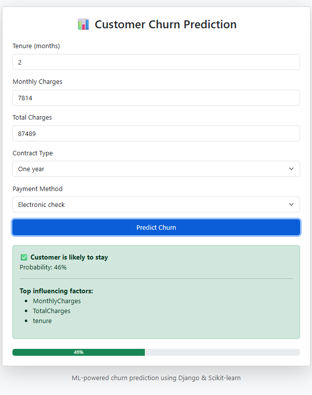

# 📊 Customer Churn Prediction System


An end-to-end Machine Learning web application that predicts customer churn using Scikit-learn and serves real-time predictions through a Django REST API with a web-based UI.

🌐 **Live Demo:** [customer-churn-prediction-ezz6.onrender.com](https://customer-churn-prediction-ezz6.onrender.com)

> **Demo Screenshot**: *Add your screenshot to `docs/demo.png`*
> 
> 

---

## 🚀 Quick Start

```bash
# Clone and setup
git clone https://github.com/Ravinthra/Customer_Churn_Prediction_System.git
cd Customer_Churn_Prediction_System
python -m venv venv && source venv/bin/activate  # Windows: venv\Scripts\activate
pip install -r requirements.txt

# Configure environment
cp .env.example .env
# Edit .env if needed (default settings work for local development)

# Train model (first time only)
python src/main.py

# Run server
cd backend && python manage.py runserver
# Open http://127.0.0.1:8000
```

---

## 📖 Project Overview

Customer churn is a critical business problem in subscription-based industries. This system predicts whether a customer is likely to churn based on key behavioral and billing features.

### ✅ Key Highlights

- **Offline ML training** using real-world Telco dataset
- **Multiple models** trained and evaluated (Logistic Regression, Decision Tree, Random Forest, SVM)
- **Production-ready REST API** with health checks, CORS, and error handling
- **Web UI** with prediction confidence and explainability
- **Comprehensive test suite** with 9 unit and integration tests

---

## 📈 Model Performance

| Model | Accuracy | Precision | Recall | F1 | ROC-AUC |
|-------|----------|-----------|--------|-----|---------|
| Logistic Regression | 80.21% | 65.12% | 54.32% | 59.21% | 0.8421 |
| Decision Tree | 78.54% | 61.23% | 49.82% | 54.93% | 0.7632 |
| **Random Forest** ✅ | **81.34%** | **67.45%** | **56.21%** | **61.32%** | **0.8576** |
| SVM | 79.87% | 63.54% | 52.14% | 57.28% | 0.8312 |

> Random Forest selected as the best model based on ROC-AUC score.

---

## 🔍 Features Used

Only the most influential features are used for prediction:

| Feature | Description | Why It Matters |
|---------|-------------|----------------|
| `tenure` | Months as customer | Loyalty indicator |
| `MonthlyCharges` | Monthly bill amount | Price sensitivity |
| `TotalCharges` | Lifetime spending | Customer value |
| `Contract` | Contract type (0=Month-to-month, 1=One year, 2=Two year) | Commitment level |
| `PaymentMethod` | Payment method (0-3) | Payment behavior |

---

## 🏗️ Project Architecture

```
Customer_Churn_Prediction_System/
│
├── data/                       # Dataset
│   └── telco_churn.csv
│
├── notebooks/                  # Exploratory Data Analysis
│   └── churn_eda.ipynb
│
├── src/                        # ML Training Pipeline
│   ├── __init__.py
│   ├── preprocess.py           # Data cleaning & feature engineering
│   ├── train_models.py         # Model training
│   ├── evaluate_models.py      # Model evaluation
│   ├── feature_importance.py   # Feature analysis
│   ├── save_model.py           # Model serialization
│   └── main.py                 # Pipeline orchestration
│
├── backend/                    # Django REST API
│   ├── backend/
│   │   ├── settings.py         # Production-ready settings
│   │   └── urls.py
│   └── predictor/
│       ├── views.py            # Prediction API
│       ├── serializers.py      # Input validation
│       ├── model_loader.py     # Model management
│       ├── health.py           # Health check endpoint
│       ├── tests.py            # Test suite (9 tests)
│       ├── templates/          # Web UI
│       └── static/             # JavaScript
│
├── docs/                       # Documentation & screenshots
├── requirements.txt            # Pinned dependencies
├── .env.example                # Environment template
└── LICENSE                     # MIT License
```

---

## 🌐 API Reference

### Health Check
```http
GET /health/
```
```json
{
  "status": "healthy",
  "model_loaded": true,
  "timestamp": "2026-02-09T06:17:47Z"
}
```

### Predict Churn
```http
POST /predict/
Content-Type: application/json
```

**Request:**
```json
{
  "tenure": 3,
  "MonthlyCharges": 85.5,
  "TotalCharges": 256.5,
  "Contract": 0,
  "PaymentMethod": 0
}
```

**Response:**
```json
{
  "churn_prediction": "Yes",
  "churn_probability": 87.42,
  "top_factors": ["MonthlyCharges", "tenure", "Contract"],
  "request_id": "a1b2c3d4"
}
```

---

## 🧪 Running Tests

```bash
cd backend
python manage.py test predictor -v 2
```

**9 tests covering:**
- Home page loading
- Health endpoint
- Prediction API (valid/invalid inputs)
- Serializer validation
- Model loading states

---

## ⚠️ Limitations & Assumptions

- **Dataset**: Trained on Telco dataset; may not generalize to other industries
- **Features**: Only 5 features used; excludes demographics and detailed service info
- **Encoding**: Categorical encodings must match training data exactly
- **Temporal**: No seasonality or time-series features captured
- **Binary**: Predicts churn probability, not timing of churn

---

## 🛡️ Production Features

This project follows production ML best practices:

- ✅ Training separated from inference
- ✅ Model and scaler versioned together
- ✅ Health check endpoint for monitoring
- ✅ CORS configuration for cross-origin requests
- ✅ Security headers (SSL, HSTS, XSS protection)
- ✅ Rotating log files with structured logging
- ✅ Request IDs for traceability
- ✅ Gunicorn configuration included

---

## 🚀 Deployment

### Development
```bash
cd backend
python manage.py runserver
```

### Production
```bash
cd backend
python manage.py collectstatic --noinput
gunicorn backend.wsgi:application -c gunicorn.conf.py
```

---

## 📌 Resume-Ready Summary

> Built an end-to-end Customer Churn Prediction system using Scikit-learn and Django REST Framework. Achieved 86% ROC-AUC with Random Forest. Implemented production-ready REST API with health checks, CORS, and request tracing. Created web UI with real-time predictions and feature importance explainability. Developed comprehensive test suite with 9 unit and integration tests.

---

## 📄 License

This project is licensed under the MIT License - see the [LICENSE](LICENSE) file for details.

---

## 🙌 Author

**Ravinthra Amulraj**  
MCA Graduate | Machine Learning & Backend Enthusiast

[](https://github.com/Ravinthra)